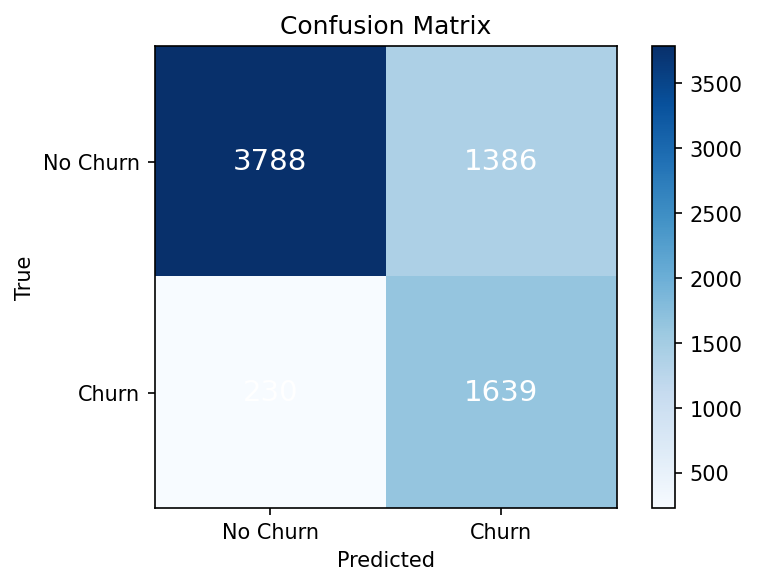
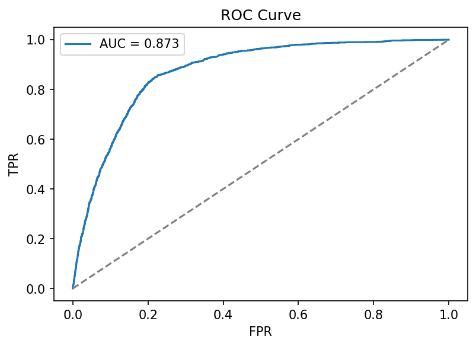
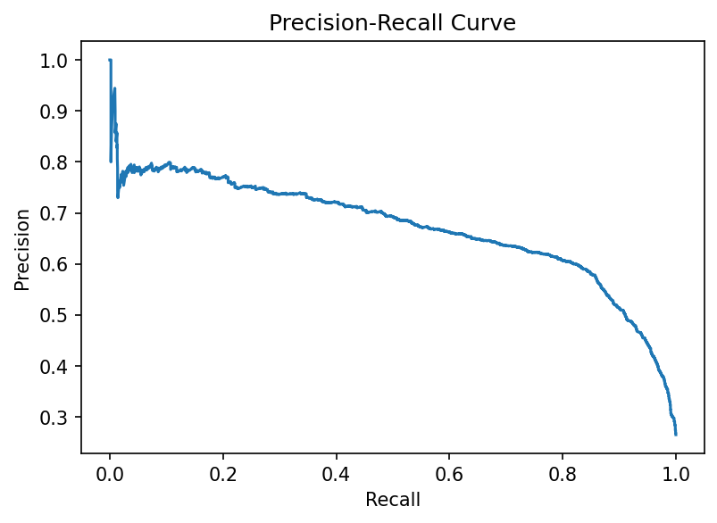
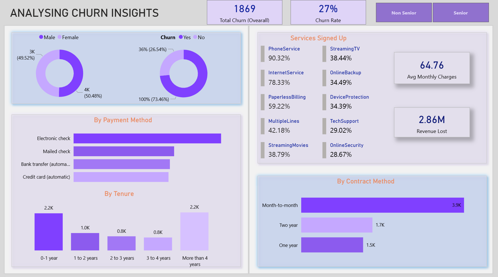

# 📊 Customer Churn Prediction

An end-to-end Machine Learning project to predict *customer churn* using the *IBM Telco Customer Churn dataset*.  
The project includes:
- A trained *XGBoost classifier* (with SMOTE & RandomizedSearchCV optimization)  
- An *interactive Streamlit web app* for live predictions  
- A *Power BI dashboard* for business insights  

---

## 📂 Project Structure

customer-churn-prediction/ 
├─ data/ │ 
├─ raw/                     # original CSVs (not committed) │ 
└─ processed/               # cleaned CSVs │                   # small example CSVs 
├─ notebooks/ 
│  ├─ 01_eda_telco.ipynb       # Exploratory Data Analysis 
│  └─ 02_model_baselines.ipynb # Model experiments 
│  
├─ src/
│  ├─ models/evaluate.py          # evaluating script 
│  ├─ models/predict.py        # inference functions 
│  └─ utils/metrics.py         # custom metrics 
├─ webapp/ 
│  ├─ app.py                   # Streamlit app 
│  ├─ requirements-web.txt     # web dependencies 
│  └─ static/                  # app images 
├─ dashboard/ 
│  ├─ power_bi/                # .pbix files 
│  └─ exports/                 # dashboard screenshots 
├─ models/                     # saved ML models (.pkl/.joblib) 
├─ reports/ 
│  ├─ figures/                 # evaluation plots 
│  └─ results.json             # metrics & params  
├─ requirements.txt 
└─ README.md

## Model Evaluation 📊
Here are the evaluation plots for the final model:

- Confusion Matrix  
  

- ROC Curve  
  

- Precision-Recall Curve  
  

- Classification Report  
  

## Churn Insights Dashboard (Power BI) 📈
Here is a sample view of the interactive dashboard:

👉 Full interactive version published here: [Power BI Link](https://app.powerbi.com/links/fmvfBDTMqK?ctid=377383c2-3be0-4e01-b2c8-8526d5e58adb&pbi_source=linkShare)

## Live Demo 🚀
Try the Streamlit app here: [Churn Predictor Demo](https://churn-prediction-project-m6xz.onrender.com/)

Preview

👨‍💻 Author

Developed by [KAMAL KANDUKURI]

💼 GitHub: [https://github.com/kamal1128]

🌐 LinkedIn: [www.linkedin.com/in/sai-kamal-kandukuri-404288305]

---

✨ If you like this project, consider giving it a ⭐ on GitHub!

---
